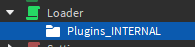
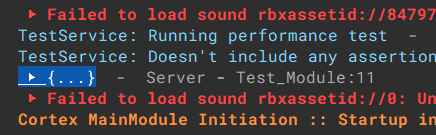
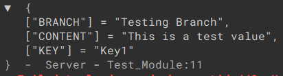
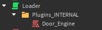

::: warning PAGE UNDER CONSTRUCTION
This page is under construction.
:::

# Internal Plugins - Setup Documentation

**The Cortex Internal Plugins system is a great system implementation for third party modules into your elevators. It allows you to access core functions from the controller itself. This guide teaches you all the basics of the implementation process.**

::: warning
The Internal Plugins system is ONLY available in the ALPHA branch of the Cortex elevator controller. To use this branch, reference [the loader code](../configuration/loader.md).
:::

## So, what are internal plugins?
As mentioned previously, the internal plugins is a method of third-party script implementation to script your own functions on your Cortex elevator. It unlocks the ability to interact with functions inside the Cortex core system as well!

## Let's get started.
Let's sort this out by steps for organization.

### Step 1- Setting up the folder
To start off, insert a `Folder` into the Loader script in your elevator. Rename the new folder to `Plugins_INTERNAL`.<br>


### Step 2- Creating the plugin module
Next, let's create a `ModuleScript`. Insert it into the folder that we created in the last step.
There are some extra substeps on the naming convention for the plugin module.
::: tip NOTE
Plugin modules may be named absolutely anything you want. Any module that is overridable and follows the naming convention
will override the core function in the Core controller.
:::

::: details NAMING CONVENTION
| Name | Overridable |
| ---- | ----------- |
| Door_Engine | Yes |
| Core_Functions | No |
| Legacy_Easing | No |
| Signal | No |
| Storage | No |
:::

::: warning
NON-OVERRIDABLE PLUGIN MODULES WILL NOT OVERRIDE CORE MODULES.
This is done for security purposes, as the Core controller solely relies on them.
<br>Any name not listed in the chart above will not affect any modules that could be overridden. They will still load & run perfectly fine.
:::

# Step 3- Code the module
If you're not experienced in Roblox developing and/or do not know how to script, don't stress yourself! This is a very basic guide on how to set this up.
Let's start with the basic fundamental functions to allow this module to run.

**Copy & paste the code samples below into your module:**
```lua
local module = {}

function module:INITIATE_PLUGIN_INTERNAL(CORE, SOURCE) -- Main initiation function for this internal plugin module

end

return module
```
::: tip
The two arguments `CODE` and `SOURCE` in the `INITIATE_PLUGIN_INTERNAL` function in the module resembles the Core module and the source script (the Loader script in this case).
:::

#### Let's add some more code to this module.
Copy & paste the code sample below into the module. Make sure this code is being pasted INSIDE the `INITIATE_PLUGIN_INTERNAL` function.
```lua
local STORAGE = require(CORE:WaitForChild('Core_Modules_INTERNAL').Storage) -- Internal storage module that is stored inside the Core module

-- Let's save some data!
local BRANCH_NAME = 'Testing Branch'
local BRANCH_KEY_NAME = 'Key1'
STORAGE:save(BRANCH_NAME, BRANCH_KEY_NAME, 'This is a test value', {OVERWRITE=false}, function(RESULT)
    -- Print the result
    print(RESULT)
end)

```
**This code sample is a test to make sure your module works properly. Run the elevator, and check the Output window in Studio to look for the printed message (shown as the highlighted text below).**

<br>Expand the table to see more details.<br>


# If you have reached this point & your test module works properly, congratulations!
Let's move on to some more setup. For this next setup, we will be installing the Legacy door system. This is an incredibly easy task, and should take very little experience to do.

##
Just like before, follow steps 1 and 2. When you insert the module, name it `Door_Engine`. This is required for the plugin module to work.<br>
<br>
This next step is the easiest. All you need to do is open the module, and copy & paste the code sample below into the module.
```lua:no-line-numbers
return require(13197567665)
```
::: tip NOTE
The module asset ID [`13197567665`](https://create.roblox.com/marketplace/asset/13197567665) is the Legacy door system core module.
:::